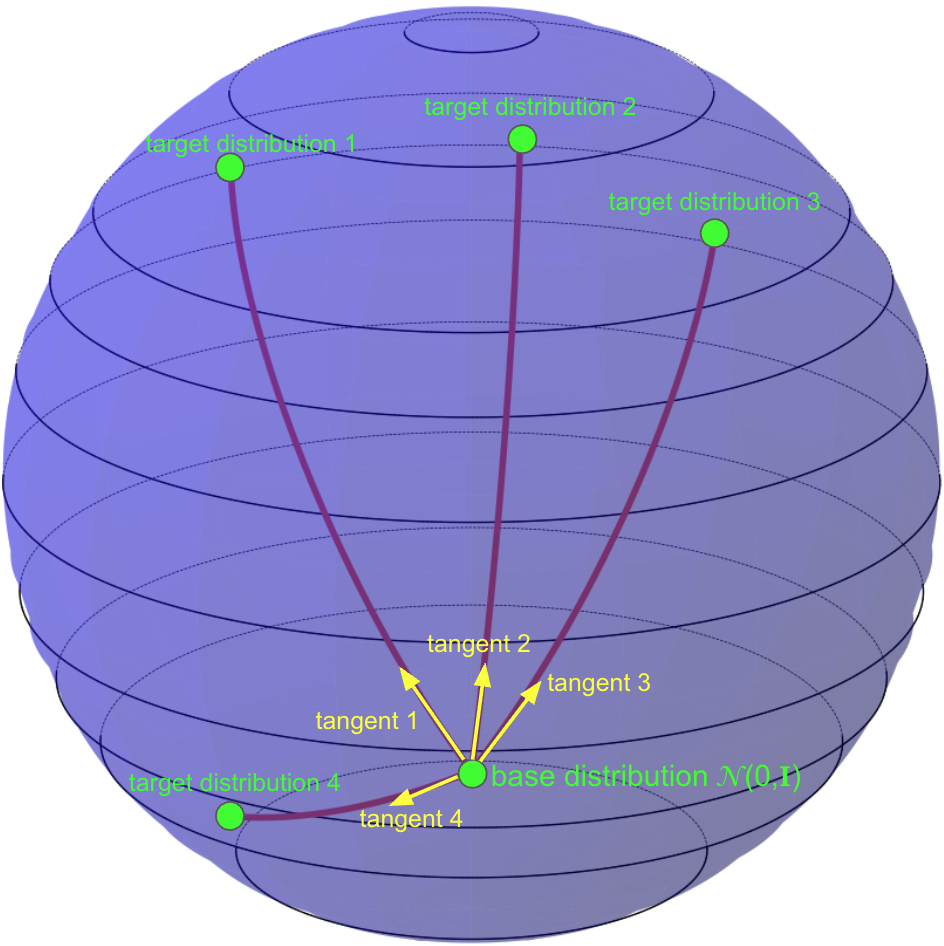
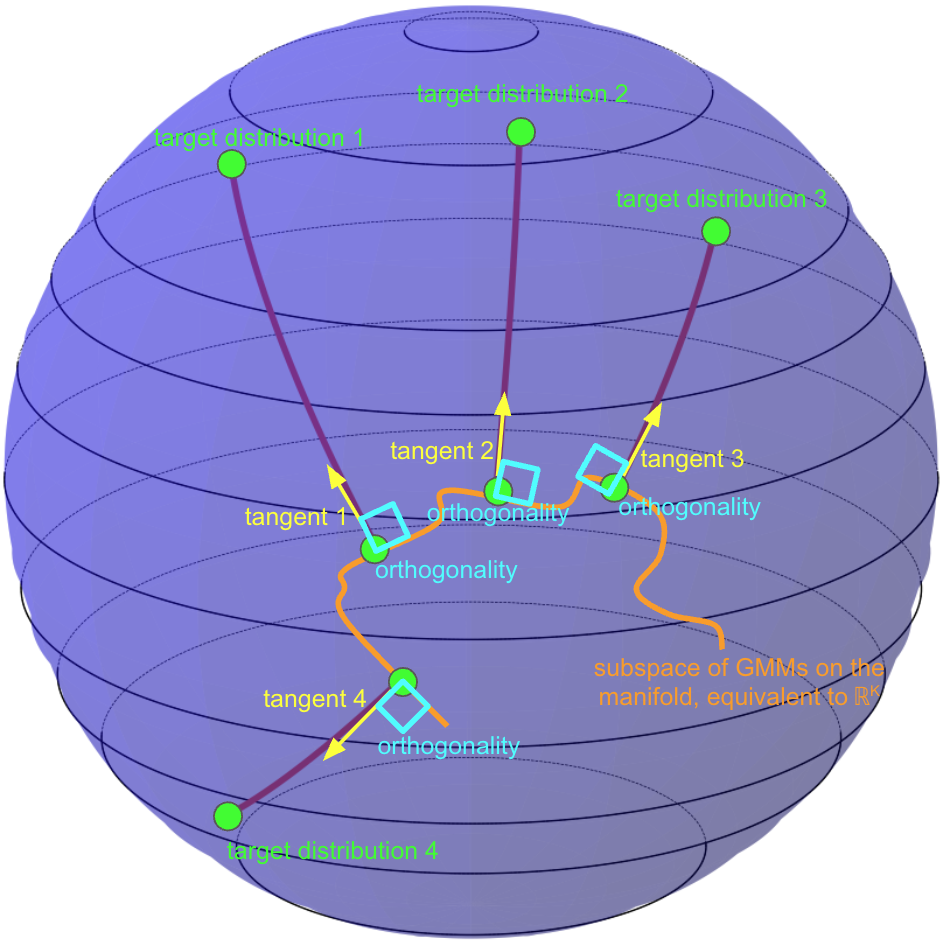

# SP-FM (MixFlow)

Shortest-Path Flow Matching with Mixture-Conditioned Bases for Out-of-Distribution Generalization to Unseen Conditions.

[Home](index.md) | [Installation](installation.md) | [Running SP-FM](running.md)

---
<table>
<tr>
<td align="center">

 
<b>(A)</b> Vanilla CFM
</td>
<td align="center">

 
<b>(B)</b> SP-FM
</td>
</tr>
</table>

## Overview

SP-FM (MixFlow) is a conditional flow-matching framework for descriptor-controlled generation. Instead of relying on a single Gaussian base distribution, SP-FM learns a mixture base and a descriptor-conditioned flow jointly, trained via shortest-path flow matching. This joint modeling is designed to extrapolate smoothly to unseen conditions and improve out-of-distribution generalization across tasks.

## Publication

This repository accompanies the arXiv manuscript:

- **Title:** *Shortest-Path Flow Matching with Mixture-Conditioned Bases for OOD Generalization to Unseen Conditions*
- **Authors:** Andrea Rubbi, Amir Akbarnejad, Mohammad Vali Sanian, Aryan Yazdan Parast, Hesam Asadollahzadeh, Arian Amani, Naveed Akhtar, Sarah Cooper, Andrew Bassett, Lassi Paavolainen, Pietro Liò, Sattar Vakili, Mo Lotfollahi
- **arXiv:** 2601.11827v2 \[cs.LG\] (11 Feb 2026)
> **Paper link:** https://arxiv.org/html/2601.11827v2

## Datasets

### Synthetic Data

We construct a synthetic benchmark of letter populations, where each condition corresponds to a letter and a specific rotation. Each descriptor encodes the letter identity and rotation, and SP-FM learns a mixture base distribution per condition. This setup allows us to test extrapolation to unseen letters and rotation angles.

### Morphological Perturbations

We evaluate SP-FM on high-content imaging data in feature space. Cells (from BBBC021 and RxRx1) are embedded with a vision backbone, and the model is trained to generate unseen phenotypic responses from compound descriptors alone.

### Perturbation Datasets

For transcriptomic perturbations, we use Chemical- or CRISPR-based single-cell datasets (Norman, Combosciplex, Replogle and iAstrocytes). Conditions correspond to perturbations' embeddings from pretrained models, and SP-FM is trained to model the distribution of perturbed cells.

Gene embeddings from GPT-4 were sourced from GenePert/GenePT data deposit.

> **URL**: https://zenodo.org/records/10833191